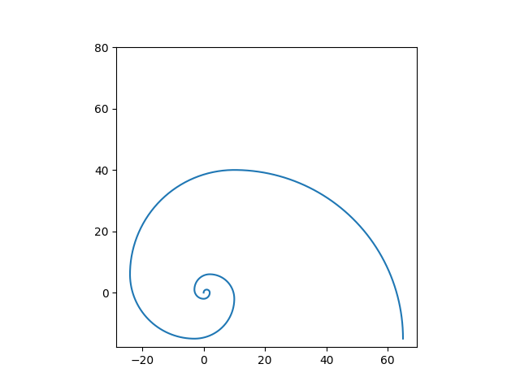

# Fibonacci Spiral Plotter

This Python script generates and visualizes a **Fibonacci Spiral** using `matplotlib` and `numpy`.

## 📜 Description
The program:
1. Calculates Fibonacci numbers up to the specified size.
2. Uses quarter-circle arcs to approximate the classic Fibonacci spiral.
3. Plots the spiral in a square aspect ratio for accuracy.

The spiral is built by drawing arcs with radii corresponding to Fibonacci numbers, connecting them in the correct sequence and orientation.

## 🛠 Requirements
- Python 3.x
- matplotlib
- numpy

Install dependencies with:
```bash
pip install matplotlib numpy

```
To run:
```bash
python Fibonacci_spiral.py
```

To modify the size of the curve, update this line:
fibonacci_curve(9)  # Change 9 to a different number


## Example Output
Below is an example spiral pattern generated by the program:
